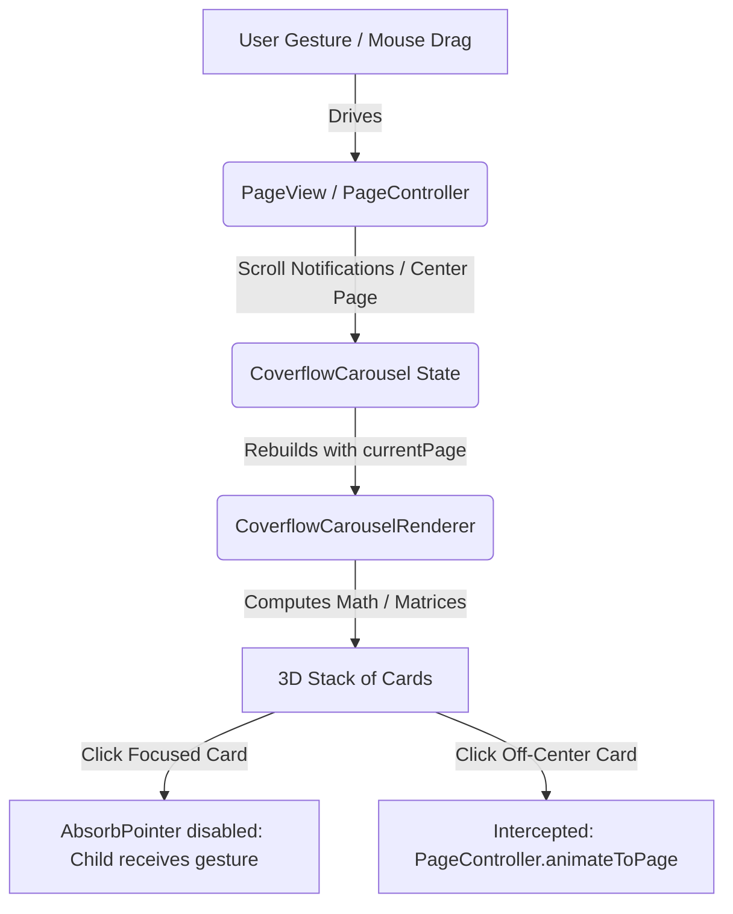

# Coverflow Carousel: Technical Architecture & Layout Mathematics

This document provides a detailed technical reference for the internal architecture, layout calculations, 3D matrices, and gesture dispatching logic of the `coverflow_carousel` Flutter package.

---

## 1. Package Architecture

The `CoverflowCarousel` uses a decoupled architecture that separates **Gesture Interaction** (tracking pointer positions, scroll drag velocity, and snapping) from **Layout Rendering** (calculating positions, scales, Y-axis skews, blurs, and depth rendering).



### 1.1 Decoupled Gesture & Rendering Stacks
To leverage Flutter's native, highly optimized physics engine for scrolling, dragging, and deceleration, we overlay two layered stacks inside a `Stack` widget:

1. **The Gesture Stack (Underlay)**: 
   Contains a standard Flutter `PageView.builder`. 
   - The children of this `PageView` are empty (`SizedBox.shrink()`). 
   - A custom `_CoverflowScrollBehavior` is applied to permit mouse dragging on desktop/web and suppress default scrollbars.
   - Its primary purpose is to maintain a `PageController` and translate swipe velocities into a continuous fractional offset (`centerIndex`).

2. **The Rendering Stack (Overlay)**:
   Contains the `CoverflowCarouselRenderer`.
   - Listens to the `PageController` page updates and rebuilds on change.
   - Draws a list of custom-positioned `Transform` widgets in a `Stack` based on the current `centerIndex`.

### 1.2 Infinite Scroll Mapping
When `isInfinite` is enabled, the `PageView` starts at a very high virtual index:
$$\text{initialVirtualPage} = (10000 \times \text{itemCount}) + \text{initialPage}$$
This virtual page number scrolls infinitely in both directions. In the renderer, we map any virtual page index $i$ back to a real index in the array using a double modulo:
$$\text{realIndex} = ((i \bmod \text{itemCount}) + \text{itemCount}) \bmod \text{itemCount}$$
This prevents out-of-bounds `RangeError` exceptions when indexing lists in the user's `itemBuilder`.

---

## 2. Layout Mathematics

All card positions, sizes, perspective angles, and depth layering are computed dynamically per frame.

### 2.1 Depth Sorting (Z-Index / 3D Layering)
In standard Flutter `Stack` widgets, the painting order is determined by the order of elements in the `children` list (later elements render on top of earlier ones). To make the active card appear on top, and cards farther away appear layered behind, we compute an abstract `zIndex` for each visible card:

- If the card index $i$ matches the rounded center index ($i = \lfloor\text{centerIndex} + 0.5\rfloor$):
  $$\text{zIndex} = 999.0$$
- Otherwise, it is calculated based on its negative absolute distance:
  $$\text{zIndex} = -|\text{centerIndex} - i|$$

The cards list is sorted by `zIndex` in ascending order before returning them to the `Stack`, ensuring background cards paint first and the focused card paints last.

```
       [ zIndex: -2.0 ]                 [ zIndex: -2.0 ]
             \                                 /
       [ zIndex: -1.0 ]                 [ zIndex: -1.0 ]
             \                                 /
                   [ zIndex: 999.0 (Center) ]
```

### 2.2 Fanning Card Positions (Horizontal Offsets)
The center card is positioned exactly at the viewport center (`maxWidth / 2`). Off-center cards fan out to the left and right. The logical pixel offset is calculated by `getCardPosition(int index)` using a two-tier spacing system (`nearCardSpacing` and `farCardSpacing`):

Let $d = \text{index} - \text{centerIndex}$ represent the signed distance from the center index. Let $SF$ represent the spacing expansion factor (driven by the entry animation, defaulting to `1.0`).

- For immediately adjacent cards ($|d| \le 1$):
  $$\text{Position}(d) = \frac{\text{maxWidth}}{2} + d \times (\text{nearCardSpacing} \times SF)$$

- For outer background cards ($|d| > 1$):
  $$\text{Position}(d) = \frac{\text{maxWidth}}{2} + \text{sgn}(d) \times (\text{nearCardSpacing} \times SF) + \text{sgn}(d) \times (|d| - 1) \times (\text{farCardSpacing} \times SF)$$

Where $\text{sgn}(d)$ is the sign of the distance ($1$ for right-side cards, $-1$ for left-side cards).

### 2.3 Card Size Scaling
To create depth, cards are scaled down as their distance $|d| = |\text{centerIndex} - i|$ increases. The width of a card at index $i$ is calculated by `getCardWidth(int index)`:

- If $|d| < 1$:
  $$\text{Width}(d) = \text{itemWidth} - (\text{itemWidth} - \text{nearWidth}) \times (|d| - \lfloor |d| \rfloor)$$
- If $1 \le |d| < 2$:
  $$\text{Width}(d) = \text{nearWidth} - (\text{nearWidth} - \text{farWidth}) \times (|d| - \lfloor |d| \rfloor)$$
- If $|d| \ge 2$:
  $$\text{Width}(d) = \text{farWidth}$$

Where:
- $\text{nearWidth} = \text{itemWidth} \times 0.88$
- $\text{farWidth} = \text{itemWidth} \times 0.72$

The card height is also scaled down:
$$\text{Height}(d) = \text{clamp}(\text{itemHeight} \times (1 - |d| \times 0.08),\, \text{itemHeight} \times 0.75,\, \text{itemHeight})$$

### 2.4 3D Projection Matrix
The skew angle and perspective are applied by modifying the widget transform matrix. 

```dart
final transform = Matrix4.identity()
  ..setEntry(3, 2, perspective)
  ..rotateY(skewAngle * distance);
```

1. **Perspective Projection**:
   In homogeneous coordinates, modifying row 3, column 2 (0-indexed `[3, 2]`) of a 4x4 matrix changes the perspective truncation along the Z-axis:
   $$M_{3,2} = \text{perspective}$$
   This division by $Z$ creates the illusion that parts of the card tilted farther away look smaller, mimicking physical 3D space.
   
2. **Rotation (Tilt)**:
   We rotate along the Y-axis by:
   $$\theta = \text{skewAngle} \times (\text{centerIndex} - \text{index})$$
   Left-side cards tilt inwards (positive rotation), and right-side cards tilt outwards (negative rotation), giving a folder-like structure.

---

## 3. Interactive Gesture Flow

A common problem in carousel widgets is **gesture hijacking**, where gestures inside cards (like button taps, text input, vertical scroll lists) collide with the parent carousel horizontal swipe drag gestures.

We solved this via a smart delegation workflow using `AbsorbPointer`:

```
               +--------------------------------------+
               |          Gesture Event               |
               +--------------------------------------+
                                  |
                        Is the card centered?
                       /                     \
                     Yes                      No
                     /                         \
         +------------------------+      +--------------------------+
         | AbsorbPointer disabled |      |  AbsorbPointer enabled   |
         |  Allows internal taps  |      | Blocks inner interaction |
         |   (e.g., buttons, etc) |      | Redirects to parent Tap  |
         |                        |      | (animates card to center)|
         +------------------------+      +--------------------------+
```

1. **Off-Center Cards**:
   Wrapped in `AbsorbPointer(absorbing: true)`. This blocks all child mouse/touch events from propagating internally. Instead, an outer `GestureDetector` captures the tap event and triggers:
   ```dart
   controller.animateToPage(index, duration: animationDuration, curve: animationCurve);
   ```
   This automatically centers the card when a user clicks/taps it.

2. **On-Center Card**:
   Wrapped in `AbsorbPointer(absorbing: false)`. The user can interact with button clicks, scroll views, sliders, or text inputs inside the active card cleanly without triggering carousel swipes unexpectedly.

---

## 4. Staggered Entry Animations

When the carousel is mounted, it can run one of several staggered animations mapped across the linear timeline $t \in [0.0, 1.0]$. Let $D = |i - \text{initialPage}|$ be the integer distance layer of card $i$ from the initial center card.

### 4.1 Staggered Timeline Partitioning
To make cards appear sequentially rather than simultaneously, we compute a localized progress value $p_i$ for each card:

- **Staggered Animations (`fadeIn`, `scaleUp`, `staggeredSlide`, `fadeScale`)**:
  The timeline is staggered by 15% per layer distance, up to a maximum 75% delay start:
  $$\text{start}_i = \text{clamp}(D \times 0.15,\, 0.0,\, 0.75)$$
  $$\text{end}_i = 1.0$$
  $$p_i = \text{clamp}\left(\frac{t - \text{start}_i}{\text{end}_i - \text{start}_i},\, 0.0,\, 1.0\right)$$

- **Stack Animation (`stack`)**:
  Splits the timeline into non-overlapping sequential windows. The center card fan-in completes first, then the next outer layer, and so on. Let $V = \text{visibleItems}$ be the visible layers:
  $$\text{intervals} = V + 1$$
  $$\text{width} = \frac{1}{\text{intervals}}$$
  $$\text{start}_i = \text{clamp}(D \times \text{width},\, 0.0,\, 1.0)$$
  $$\text{end}_i = \text{start}_i + \text{width}$$
  $$p_i = \text{clamp}\left(\frac{t - \text{start}_i}{\text{width}},\, 0.0,\, 1.0\right)$$

### 4.2 Animation Property Mapping
For each entry animation type, the local card progression $p_i$ is mapped to opacity ($\alpha$), scale ($S$), and horizontal/vertical translations ($T_X, T_Y$):

| Animation Type | Opacity ($\alpha$) | Scale ($S$) | Translation ($T_X, T_Y$) | Description |
| :--- | :--- | :--- | :--- | :--- |
| `none` | $1.0$ | $1.0$ | $(0, 0)$ | Instant layout rendering. |
| `fadeIn` | $p_i$ | $1.0$ | $(0, 0)$ | Cards fade in sequentially. |
| `scaleUp` | $1.0$ | $0.8 + 0.2 \times p_i$ | $(0, 0)$ | Cards scale up from 80% to 100% size. |
| `spacingExpand` | $1.0$ | $1.0$ | Dynamic Spacing | Card positions expand outward. |
| `staggeredSlide` | $p_i$ | $1.0$ | $T_X \text{ or } T_Y$ | Center drops down; sides slide in from left/right. |
| `fadeScale` | $p_i$ | $0.8 + 0.2 \times p_i$ | $(0, 0)$ | Combines sequential fade and scale. |
| `stack` | $\text{clamp}(2.0 \times p_i, 0.0, 1.0)$ | $1.8 - 0.8 \times p_i$ | $(0, 0)$ | Cards drop onto stacking positions from the front. |

---

## 5. API Reference Guide

### 5.1 CoverflowCarousel.builder Properties

| Property | Type | Default Value | Description |
| :--- | :--- | :--- | :--- |
| `itemCount` | `int` | *Required* | Total number of cards to display. |
| `itemBuilder` | `IndexedWidgetBuilder` | *Required* | Builder callback returning the child widget. |
| `itemWidth` | `double` | *Required* | Width of the focused center card. |
| `itemHeight` | `double` | *Required* | Height of the focused center card. |
| `visibleItems` | `int` | `3` | Number of visible background cards on each side of center. |
| `obscure` | `double` | `0` | Blur intensity parameter for off-center cards. |
| `skewAngle` | `double` | `-0.35` | Y-axis rotation skew angle in radians for off-center cards. |
| `initialPage` | `int` | `0` | Index of the card focused at startup. |
| `nearCardSpacing` | `double` | `45` | Horizontal separation to adjacent cards at distance 1. |
| `farCardSpacing` | `double` | `50` | Horizontal separation between background cards at distance >= 2. |
| `perspective` | `double` | `0.0025` | 3D matrix perspective factor. |
| `isInfinite` | `bool` | `false` | Enables infinite looping of cards. |
| `viewportFraction` | `double` | `0.25` | Fraction of viewport size occupied by scroll tracking. |
| `animationDuration` | `Duration` | `350ms` | Duration for drag scroll snapping & controller transitions. |
| `animationCurve` | `Curve` | `Curves.easeOutCubic` | Easing curve for transition snapping. |
| `controller` | `CoverflowCarouselController` | `null` | Programmatic control instance. |
| `onPageChanged` | `ValueChanged<int>` | `null` | Callback triggered when the focused page changes. |
| `entryAnimation` | `CoverflowEntryAnimation` | `none` | Mounting entry animation type. |
| `entryAnimationDuration` | `Duration` | `1000ms` | Total duration of the entry animation. |
| `entryAnimationCurve` | `Curve` | `Curves.easeOutCubic` | Easing curve for the entry animation. |
